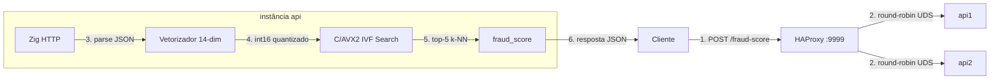

<h1 align="center">Rinha de Backend 2026 — Zig + C/AVX2</h1>

<p align="center"><strong>API de detecção de fraude usando busca vetorial IVF com kernels AVX2 otimizados à mão</strong></p>

<p align="center">
  
  
  
  
</p>

---

**Submissão para a [Rinha de Backend 2026](https://github.com/zanfranceschi/rinha-de-backend-2026)** — detecção de fraude via busca vetorial. Processa transações de cartão através de um vetorizador de 14 dimensões, busca 3 milhões de vetores de referência usando IVF/K-means com distância Euclidiana acelerada por AVX2, e retorna a probabilidade de fraude via votação majoritária k-NN.

## Início Rápido

```bash
docker compose up --build
```

A API escuta na porta `9999`. Use o smoke test para verificar:

```bash
# Requer k6 (https://k6.io)
# Baixe test-data.json do repositório rinha-de-backend-2026, então:
k6 run test.js
```

### Imagens pré-construídas (via GitHub Release)

```bash
IMAGE=ghcr.io/macedot/rinha-2026-zig:latest docker compose up
```

Substitua `build: .` por `image: ghcr.io/macedot/rinha-2026-zig:latest` no `docker-compose.yml`.

## API

### `GET /ready`

Retorna `200 OK` quando a API carregou o índice e está pronta para atender requisições.

### `POST /fraud-score`

**Requisição:**
```json
{
  "id": "tx-1329056812",
  "transaction":      { "amount": 41.12, "installments": 2, "requested_at": "2026-03-11T18:45:53Z" },
  "customer":         { "avg_amount": 82.24, "tx_count_24h": 3, "known_merchants": ["MERC-003", "MERC-016"] },
  "merchant":         { "id": "MERC-016", "mcc": "5411", "avg_amount": 60.25 },
  "terminal":         { "is_online": false, "card_present": true, "km_from_home": 29.23 },
  "last_transaction": null
}
```

**Resposta:**
```json
{ "approved": true, "fraud_score": 0.0000 }
```

Contrato completo da API: [docs/en/API.md](https://github.com/zanfranceschi/rinha-de-backend-2026/blob/main/docs/en/API.md)

## Arquitetura

```
                           ┌──────────┐
                           │  Client  │
                           └─────┬────┘
                                 │ HTTP :9999
                          ┌──────▼────────┐
                          │  HAProxy 3.3  │
                          │  cpus: 0.2    │
                          │  mem:  30 MB  │
                          └───┬───────┬───┘
                              │       │
                     UDS /sockets/    UDS /sockets/
                      api1.sock       api2.sock
                   ┌──────▼──────┐ ┌──────▼──────┐
                   │    api1     │ │    api2     │
                   │ cpus: 0.4   │ │ cpus: 0.4   │
                   │ mem: 160 MB │ │ mem: 160 MB │
                   │             │ │             │
                   │┌───────────┐│ │┌───────────┐│
                   ││Zig HTTP   ││ ││Zig HTTP   ││
                   ││UDS server ││ ││UDS server ││
                   │└─────┬─────┘│ │└─────┬─────┘│
                   │      │      │ │      │      │
                   │┌─────▼─────┐│ │┌─────▼─────┐│
                   ││Vetorizador││ ││Vetorizador││
                   ││ 14-dim    ││ ││ 14-dim    ││
                   │└─────┬─────┘│ │└─────┬─────┘│
                   │      │      │ │      │      │
                   │┌─────▼─────┐│ │┌─────▼─────┐│
                   ││ C/AVX2    ││ ││ C/AVX2    ││
                   ││ IVF Search││ ││ IVF Search││
                   ││ 4096 clst.││ ││ 4096 clst.││
                   │└───────────┘│ │└───────────┘│
                   └─────────────┘ └─────────────┘

    ┌──────────────────────────────────────────────────────┐
    │  rinha-sockets (tmpfs, 10mb)  ·  bridge network      │
    │  CPU total: 1.0   |   Memória total: 350 MB          │
    └──────────────────────────────────────────────────────┘
```

### Fluxo da requisição



### Como funciona

1. O **cliente** envia `POST /fraud-score` com JSON da transação para a porta `9999`
2. O **HAProxy** distribui via round-robin a requisição HTTP bruta sobre **Unix Domain Socket** (`/sockets/api1.sock` ou `api2.sock`) — zero overhead TCP, sem inspeção de payload
3. O **servidor HTTP Zig** faz parse do body JSON (parser customizado sem alocação) e extrai todos os campos
4. O **vetorizador** transforma o payload em um vetor float de 14 dimensões usando as fórmulas oficiais de normalização, depois quantiza para `int16` para o bridge C
5. O **IVF Search C/AVX2** seleciona os clusters mais próximos (de 4096), escaneia seus pontos com distância Euclidiana acelerada por AVX2 (terminação antecipada + unroll 2x), e retorna os k=5 vizinhos mais próximos
6. **fraud_score** = fraudes entre os top 5 / 5; `approved = fraud_score < 0.6`

### Componentes

| Componente | Linguagem | Função |
|------------|-----------|--------|
| **HAProxy 3.3** | C | Load balancer Layer 4, round-robin via UDS (`balance roundrobin`) |
| **Servidor HTTP Zig** | Zig | Handling HTTP, listener UDS/TCP, parser JSON sem alocação |
| **Vetorizador** | Zig | Vetorizador de features 14-dim seguindo regras oficiais de normalização; quantização `int16` |
| **IVF Search bridge** | C/AVX2 | Busca IVF/K-means: 4096 clusters, ranking por distância de centroides, distância Euclidiana AVX2 com terminação antecipada |
| **build_index** | Zig | Pré-processa `references.json.gz` (3M vetores) em índice binário IVF1: clustering K-means, quantização `int16`, layout AoSoA coluna-maior |

### Transporte

O HAProxy se comunica com as instâncias da API via **Unix Domain Sockets** em um volume `tmpfs` (`rinha-sockets`). Isso elimina o overhead TCP inteiramente — sem stack de rede no kernel, sem buffers de socket, sem filas de accept. Um único volume tmpfs de 10 MB armazena ambos os arquivos de socket.

### Stack Tecnológica

- **Zig 0.16** — Servidor HTTP customizado, transporte UDS, parser JSON sem alocação
- **C** — Intrínsecos AVX2 para distância Euclidiana, motor de busca IVF/K-means
- **HAProxy 3.3** — Load balancer stateless round-robin
- **Docker Compose** — 3 serviços, rede bridge, limites de recursos via `deploy.resources.limits`

## Otimizações

O kernel de busca IVF passou por extensa micro-otimização visando latência p99 com limites Docker de 1.0 CPU e 350 MB de memória total.

| Otimização | Técnica |
|------------|---------|
| **4096 clusters IVF** | Particionamento mais fino reduz pontos escaneados por query |
| **Terminação antecipada AVX2** | Pula dimensões restantes para batches onde todas as 8 lanes excedem a pior distância após as primeiras 7 dimensões |
| **Unroll 2x** | Processa 16 elementos por iteração com acumulação intercalada de dimensões para esconder latência de memória |
| **Reordenação de clusters** | Escaneia clusters menores primeiro para apertar `worst_d` mais cedo, habilitando mais terminação antecipada |
| **Respostas HTTP pré-computadas** | Slices de bytes estáticos evitam alocações por requisição |
| **Transporte UDS** | HAProxy <-> API via Unix Domain Sockets (zero overhead TCP) |

## Configuração

| Variável | Padrão | Descrição |
|----------|--------|-----------|
| `INDEX_PATH` | `resources/index.bin` | Caminho para o índice binário IVF1 |
| `IVF_NPROBE` | `8` | Número de clusters IVF para probe (passada rápida) |
| `IVF_FULL_NPROBE` | `24` | Número de clusters IVF para probe (passada completa) |
| `CANDIDATES` | `0` | Máximo de candidatos para escanear por cluster (0 = ilimitado) |
| `LISTEN_TCP` | `0` | Usa TCP ao invés de UDS (`1` = TCP) |
| `PORT` | `9999` | Porta de escuta TCP |
| `HOST` | `0.0.0.0` | Endereço de escuta TCP |
| `UDS_PATH` | — | Caminho do Unix Domain Socket (obrigatório no modo UDS) |
| `UDS_MODE` | `666` | Permissões do arquivo de socket (decimal, ex: 666 = rw-rw-rw-) |
| `UNLINK_UDS` | `1` | Remove socket antigo antes do bind |
| `TCP_NODELAY` | `1` | Habilita TCP_NODELAY |
| `USE_ZIG` | — | Se definido, usa busca IVF pura em Zig ao invés do bridge C |

## Estrutura do Repositório

```
├── zig/
│   ├── build.zig                # Build system Zig (compila bridge.c + fontes Zig)
│   └── src/
│       ├── main.zig             # Entry point: carrega índice, aquece cache, inicia servidor
│       ├── config.zig           # Configuração baseada em variáveis de ambiente
│       ├── http_server.zig      # Servidor HTTP TCP/UDS usando C POSIX sockets
│       ├── http_resp.zig        # Respostas HTTP estáticas pré-computadas
│       ├── vectorizer.zig       # Vetorizador de features 14-dim + parser JSON customizado
│       ├── mcc_risk.zig         # Tabela de lookup de risco MCC via JSON
│       ├── dataset.zig          # Loader de índice binário IVF1
│       ├── c_bridge.zig         # Wrapper fino sobre o bridge C/AVX2
│       ├── bridge.c             # Kernel de busca IVF C/AVX2
│       ├── bridge.h             # Header do bridge C
│       ├── build_index.zig      # Builder de índice IVF1 (K-means + quantização)
│       └── ivf_search.zig       # Implementação de busca IVF pura em Zig
├── resources/
│   ├── index.bin                # Índice IVF1 pré-construído (3M vetores)
│   ├── mcc_risk.json            # Tabela de risco por categoria de comerciante
│   └── references.json.gz       # 3M vetores de referência rotulados
├── data/
│   ├── index.bin                # Índice IVF1 construído (saída do build_index)
│   └── index.bin.gz             # Índice IVF1 comprimido
├── Dockerfile                   # Multi-stage: build Zig → runtime Debian slim
├── docker-compose.yml           # Deploy 3 serviços com limites de recursos
├── haproxy.cfg                  # Configuração HAProxy round-robin UDS
├── autoresearch.sh              # Runner de benchmark (docker compose + k6)
├── .github/workflows/release.yml # CI: build & push imagem Docker no GHCR
├── LICENSE                      # MIT
├── info.json                    # Info do participante da Rinha
└── README.md
```

## CI/CD

GitHub Actions faz build e push de uma imagem Docker `linux/amd64` para `ghcr.io/macedot/rinha-2026-zig` a cada release publicada (prereleases excluídas). Imagens são tagueadas com a versão da release e `latest`.

## Agradecimentos

O kernel de busca IVF em C/AVX2 (`bridge.c`) é um port da implementação do [rinha-2026-rust](https://github.com/jairoblatt/rinha-2026-rust) do [@jairoblatt](https://github.com/jairoblatt). Obrigado pela excelente referência — o formato de índice IVF1, o layout de blocos AoSoA e os kernels de distância AVX2 são baseados diretamente nesse trabalho.

## Licença

Este projeto está licenciado sob a [Licença MIT](LICENSE).
